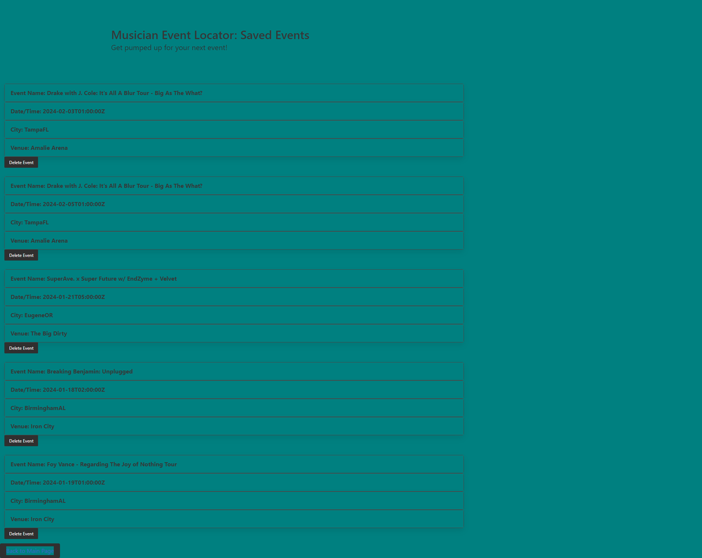

# Musician-event-tracker

## Description
The Musicial Event Locator is a tool for fans to find out what events will be held in their city. The motivation for this application was to make finding events fast and simple. This application will allow the user to pinpoint a number of concerts in their local or surrounding cities and states. Through this project the team learned that we have a long way to go in our developer journeys. Implementation of your ideas aren't always going to go as planned but if you plan properly you will be able to accomplish more with less work.

## Usage

The best way to utilize the application is having an artist name, city and state of which you would like to attend an event. Once you have selected who or where you would like to attend the event you can hit the search button and events in the area will populate for you to choose from. You have the ability to save the event infomation and there will be a button that take you to a list of your chosen events.

.png).

.

## Credits

Daniel - https://github.com/ThaDarkLord
Josh - https://github.com/ih8josh
Miah - https://github.com/xWhoKnowz

Bulma CSS framework
https://blog.logrocket.com/localstorage-javascript-complete-guide/#:~:text=of%20a%20localStorage-,Storing%20data%20with%20setItem(),the%20value%20attached%20to%20it. - local storage site

LastFM API
https://www.last.fm/api

TicketMaster API
https://developer.ticketmaster.com/products-and-docs/apis/discovery-api/v2/ 

link to deployed application:
https://thadarklord.github.io/event-tracker/index.html

